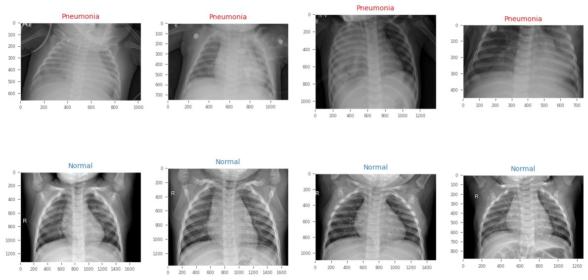
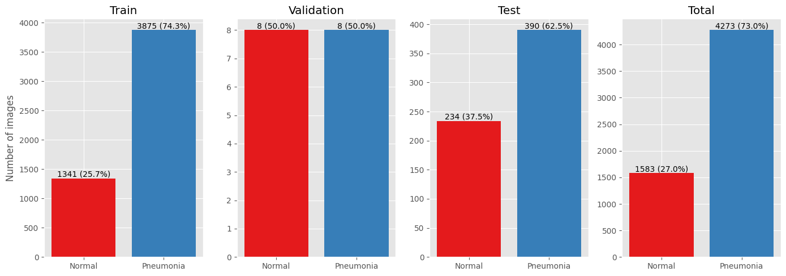
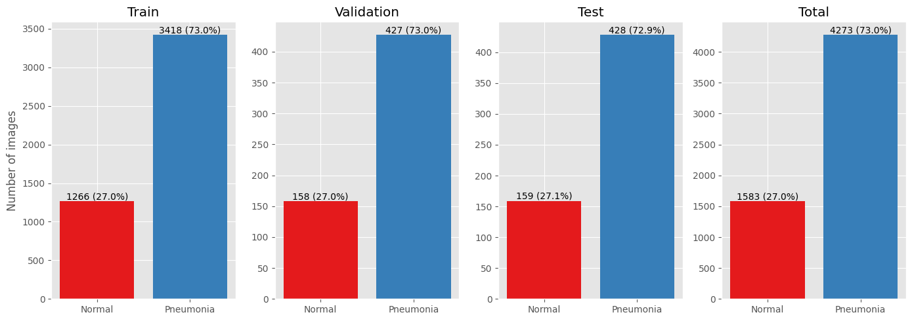
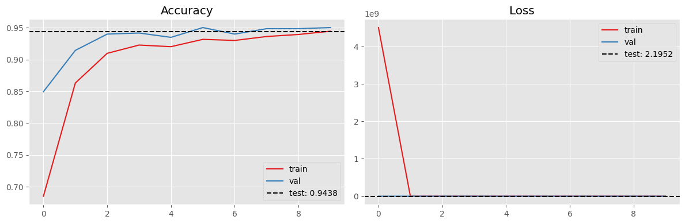
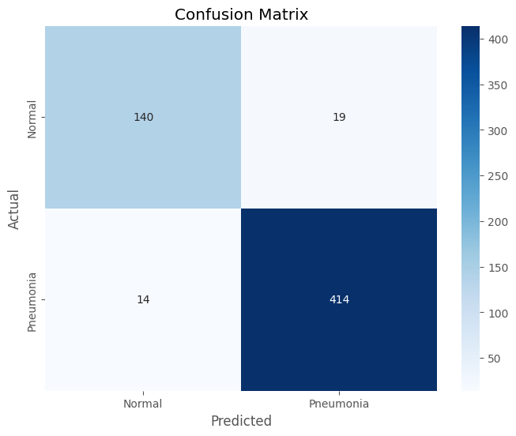
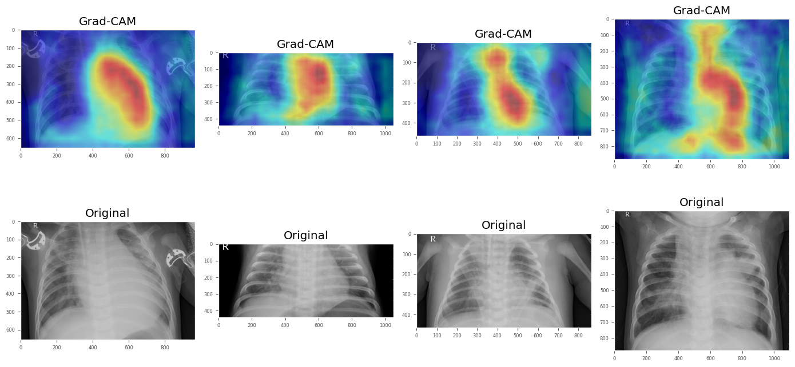
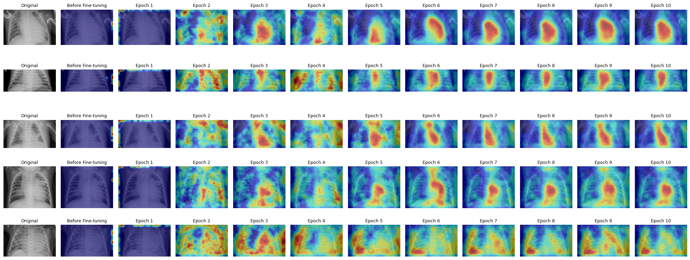

## Overview
## Analyzing Domain Shift and Transferability in Deep Learning: A Case Study in Medical Image Analysis
This repository features **IMPACT-Net** (Imaging Method for Pneumonia Analysis and Cross-domain Transfer Network), a custom deep learning framework built on ResNet. The project addresses the challenge of domain shift in multi-source biomedical datasets, using binary classification of chest X-rays (Normal vs. Pneumonia) as a clinical case study. 

### Key Features
* **Custom Architecture:** Adapted ResNet into IMPACT-Net to optimize cross-domain transferability.
* **Robust Pipeline:** Custom preprocessing featuring image normalization, data augmentation, and balanced dataset sampling.
* **Explainable AI:** Integrated Grad-CAM heatmaps to localize pneumonia-affected lung regions for clinical review.

## 🩺 How an AI Learns to Diagnose Pneumonia

This section breaks down the end-to-end pipeline of how the framework processes data, trains the model, and explains its clinical decisions.

### 1. The Setup: Gathering the Tools
Every great project starts with a toolbox. We begin by installing **Grad-CAM**—a specialized tool that acts like a "magnifying glass" for AI, allowing us to see which parts of an image the model is focusing on. We also import core libraries like **PyTorch** (the engine) and **Matplotlib** (the artist) to handle the heavy lifting and data visualization.

### 2. Preparing the Workspace
To make sure our results aren't just a fluke, we set a **random seed for reproducibility**. Think of this as making sure the experiment runs the exact same way every single time we hit "start."

### 3. Fetching the Data
We utilize a massive dataset of thousands of chest X-rays from **Kaggle** (leveraging the NIH Chest X-ray14 architecture guidelines). These images are categorized into two groups: *Normal* and *Pneumonia*. 
* **Data Reorganization:** Because the original dataset distribution required specific balancing for cross-domain analysis, we programmatically split the files into:
  * **Training set:** To study patterns
  * **Validation set:** For practice quizzes during training
  * **Test set:** For the final exam

### 4. A First Look (Data Exploration)
Before the AI starts learning, we inspect the data. The repository includes scripts to generate:
* **X-Ray Grid:** Visualizes clear *Normal* scans alongside *Pneumonia* scans showing cloudy fluid areas in the lungs.
 

* **Class Distribution Chart:** bar charts showing image counts to ensure the AI has a balanced set of examples to learn from.

### 5. Teaching the AI (Training)
We leverage a powerful pre-trained **Inception v3 / ResNet** architecture. While it initially knows how to recognize general shapes, we fine-tune its deep layers to recognize complex medical patterns.

* **The Trainer Class:** A custom wrapper that manages the learning loops, handles optimization, and automatically saves the best-performing version of the model weights.
* **The Progress Charts:** Generates two live line graphs:
  * **Accuracy Chart:** Shows the AI getting smarter over time.
  * **Loss Chart:** Tracks its mistakes getting smaller with every epoch.

  

### 6. The Final Grade
Once training concludes, we expose the model to entirely unseen test data. 
* **Confusion Matrix:** A blue heatmap that maps exactly where the AI succeeded and where it got confused between Normal and Pneumonia cases. 
* **Performance:** With a top accuracy of **over 94%**, the network proves to be a highly effective diagnostic tool.

### 7. X-Ray Vision: Grad-CAM (The Story of Learning)
This is the most critical part of the explainability framework. We use **Grad-CAM** to overlay visual heatmaps directly onto the X-rays:
* 🔥 **Red/Yellow areas:** Indicate the exact pixels the AI weighted most heavily to make its final diagnosis.

* 📊 **The Transformation Grid:** A final large chart comparing the original X-ray against a sequence of heatmaps across training.

> **The Learning Narrative:** Before fine-tuning, the heatmaps are scattered and random. By **Epoch 10**, the heatmaps focus tightly on the specific lung regions where pneumonia resides, proving the AI isn't just guessing—it's looking at the exact clinical evidence.

